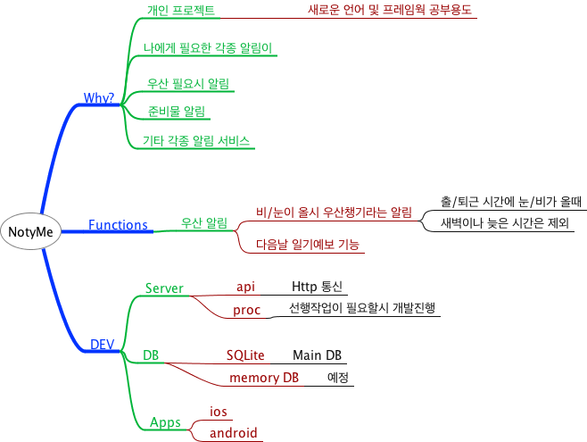
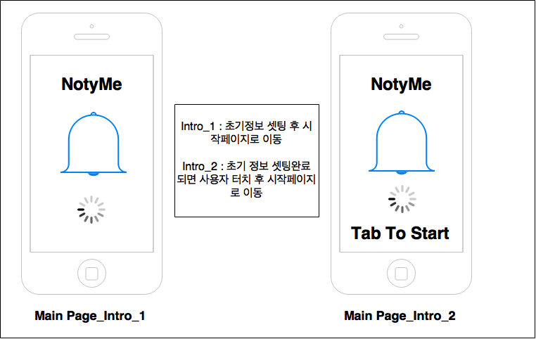

# one day, once, one project by 111

## NotyMe
- 개인형 알림 서비스.
- 다음날 챙길것들을 까먹지 말자.

### Why?

- 나만을 위한 알림 서비스.
    - 우산 챙길 정신머리가 없어서..ㅠㅠ
    - TODO List 를 쓰기엔 좀 복잡하고 어려워서.
    - 그냥 까먹지 않게 알림만 해주면 됨.
    - 간단하게 설정하고 귀찮게 알림 받자.

- 개인 프로젝트.
	- 새로운 언어 및 프레임웍 적용 및 사용경험을 위해.
	- 개발의 감각을 잃어 버리지 않기 위한 몸부림.
	- 해보고 싶은 아이디어가 생기면 적용할 수 있는 바탕을 만들기.

### Functions
- 1차
	- 우산 알림.
	- 우천시 우산을 챙기라는 알림.
	- 나처럼 날씨 체크를 제대로 못하는 사람을 위한 귀차니즘 제거용.
		- 날씨 API 사용하여 날씨 정보 가져오기
			- [openweathermap](http://openweathermap.org/API)
			- 날씨 정보 저장
        - 사용자(앱) 정보처리 API
	        - 사용자 알림설정 정보 저장
		        - 날짜(익일, 당일), 시간, 반복..
        - 날씨 정보 조회
        - 푸쉬

### Dev 

#### Server

#### DB

#### UI

- App
	- ios
	- android
	- mail
	- SNS

#### 화면 설계

* Intro Page

